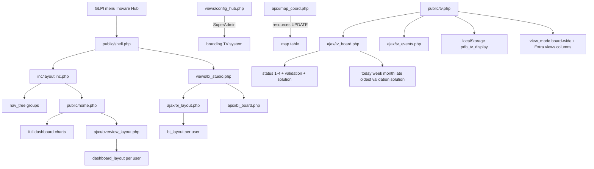

# Arquitetura — Painel de Bordo 2.32.1

## Visão geral

## Shell moderno
- Nav: `plugin_paineldebordo_nav_tree()` — Chamados / Análise / Recursos / Admin
- Período: `plugin_paineldebordo_period_label()`
- CSS: `.ho-dash-grid` / `.ho-prefs` na Overview mural

## Overview
- NOC board: KPIs fluxo+snapshot, filas, charts (period/group/entity)
- Personalizar mural: `dashboard_layout` (toggle/reorder + hero/spotlight)
- AJAX: `overview_board.php`, `overview_layout.php`

## BI Studio (`page=metrics`)
- Substitui Métricas: canvas GridStack, modos Visualizar/Editar, abas, período por página
- Widgets: KPI / chart / text; config `bi_layout`
- AJAX: `bi_board.php` (GET salvo / POST `layout` rascunho), `bi_layout.php` (persistir)
- Cliente mantém layout em memória ao editar; só troca pelo servidor após Salvar / Reset / boot
- Tela cheia: `#ho_bi_root` vai para `body` (z-index 4000) + Fullscreen API; Esc / botão sai

## Ativos NOC (`page=assets`)
- Frota: Computer / Monitor / NetworkEquipment / Printer / Phone / Peripheral
- Inventário: `glpi_items_disks`, `glpi_items_devicememories`, `glpi_agents`, `glpi_infocoms`, OS, licenças
- Serviço `inc/services/assets.php` + AJAX `assets_board.php`

## Modo TV
1. Board: filas 1–4 + **Validação** (`global_validation=2`) + **Aprov. solução** (status 5 + solution WAITING)
2. Events: toasts com `date_approval` para soluções
3. Cards: group/tech/requester/date/observers/category + botão Prévia (modal) + Ver; "+N mais" linka pra `shell.php?page=tickets` (status real ou `view=validation|solution`)
4. Prefs: `pdb_tv_display`
5. GLPI: validation WAITING=2 ACCEPTED=3; solution WAITING=2 ACCEPTED=3 REFUSED=4

## Configuração
- Hub `config_hub.php` (Super-Admin estrito)
- Ver [`docs/PERMISSIONS.md`](PERMISSIONS.md)

## Logs e auditoria (`page=logs`)
- Hub `logs_hub.php` (Super-Admin, mesmo gate da Configuração); lógica em `inc/audit.inc.php`
- Tabelas: `glpi_plugin_paineldebordo_accesslog` (trilha append-only) + `glpi_plugin_paineldebordo_presence` (upsert → ativos agora)
- Registra sessão (1×/sessão) + ações sensíveis (config, export relatório/gráfico, parear/revogar TV); export de gráfico via beacon `ajax/audit.php`
- Lê logins nativos do GLPI de `glpi_events` (service=login); avatar por usuário via `plugin_paineldebordo_user_avatar()`
- Retenção `logs_retention_days` (0 = herda GLPI; N>0 = purga inline throttled)

## Direitos
- Master READ → app / Overview / TV / pairing
- `plugin_paineldebordo_groups` READ → visão ampla de grupos; Super-Admin também
- Master UPDATE **não** controla escopo de grupos (2.32.0+)
- TV: `view_mode` + Visões extras; entidade única travada
- Módulos tickets / analysis / resources → ver [`PERMISSIONS.md`](PERMISSIONS.md)
- Admin / Config → Super-Admin (nome ou GLPI `config` UPDATE)